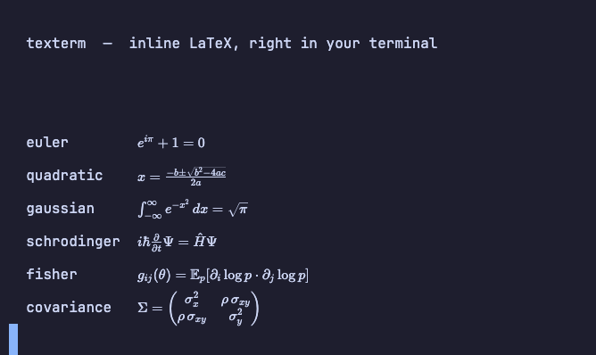
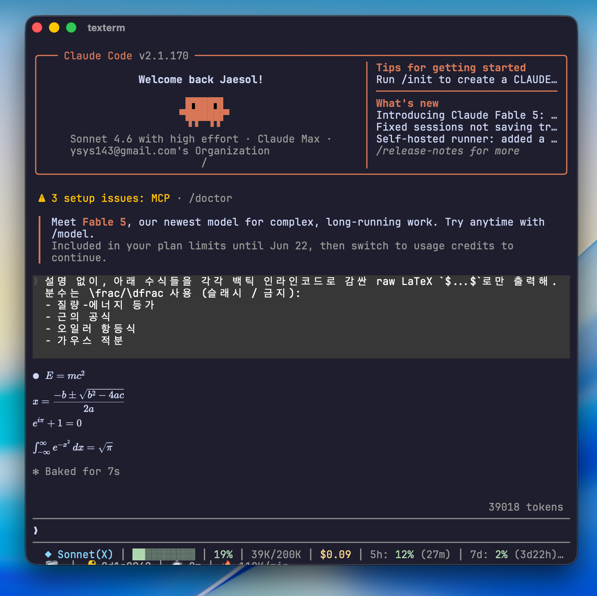

<h1 align="center">texterm</h1>

<p align="center">
  <a href="./README.md">English</a> · <b>한국어</b>
</p>

<p align="center">
  Claude Code와 Codex의 수식을 <b>인라인 LaTeX</b>로 그려주는 macOS 터미널.<br/>
  출력에 <code>$...$</code> / <code>$$...$$</code> 가 나오면 그 자리에서 KaTeX로 조판합니다.
</p>

<p align="center">
  
  
  
  
</p>

<p align="center">
  
</p>

---

터미널은 `\int_{-\infty}^{\infty} e^{-x^2}\,dx = \sqrt{\pi}` 를 백슬래시 그대로 보여줍니다. texterm은 그 아래에 진짜 터미널(VT 에뮬레이터)을 두고, `$...$` 가 들어간 줄 위에 조판된 수식을 덮어 그립니다.

## 기능

- **인라인 수식 렌더링** — 보이는 행을 스캔해 `$...$` / `$$...$$` 를 KaTeX로 조판. 디바운스되어 빠른 출력도 따라갑니다.
- **진짜 터미널** — [xterm.js](https://xtermjs.org/)가 커서·줄편집·스크롤백·선택·alt-screen TUI를 처리. `claude`·`codex` 같은 풀스크린 앱도 그대로 동작합니다.
- **한글 / CJK 입력** — WebKit에서 깨지는 IME 조합을 직접 처리해 한글이 음절 단위로 올바르게 들어갑니다.
- **폰트 · 줄간격 조절** — `Cmd +/-` 폰트, `Cmd+Shift +/-` 줄간격. 키 큰 수식(분수·적분·행렬)이 겹치지 않게 여백을 확보하고, 설정은 재실행해도 유지됩니다.
- **안정적 코드 서명** — 한 번 `make cert` 하면 재빌드해도 macOS 권한 허가가 풀리지 않습니다.

## 미리보기

<p align="center">
  
</p>

## 설치

요구 사항: macOS 13+, Xcode 커맨드라인 도구(`swiftc`·`clang`·`codesign`), 그리고 에셋 다운로드용 `npm`.

```sh
make setup     # KaTeX + xterm.js 를 Resources/ 에 받아옴 (최초 1회)
make cert      # 안정적 self-signed 서명 신원 생성 (최초 1회, 아래 "권한" 참고)
make build     # .app 빌드
make install   # ~/Applications/texterm.app 로 설치
```

`make run` 으로 빌드 후 바로 실행할 수도 있습니다.

## Claude Code / Codex와 함께 쓰기

`claude`·`codex`는 기본적으로 수식을 유니코드(`²`·`√`·`±`)로 그려서 `$` 구분자가 없고, 산문 속 맨 `$...$`는 터미널 마크다운이 백슬래시(`\\`·`\!`·`\,`)를 떼어내 깨집니다. 그래서 **수식을 백틱 코드로 감싸** raw LaTeX를 보존해야 texterm이 제대로 렌더합니다.

`~/.claude/CLAUDE.md`(전역) 또는 프로젝트 `CLAUDE.md`에 한 단락 넣어두면 매번 안 적어도 됩니다:

```
수학 수식은 항상 백틱 인라인코드로 감싼 raw LaTeX로 출력.
  인라인: `$ ... $`      디스플레이 / 행렬: `$$ ... $$`
유니코드·ASCII 아트로 바꾸지 말고, 분수는 \frac, 각 수식은 한 줄로.
```

## 키보드 단축키

| 단축키 | 동작 |
|---|---|
| `Cmd +` / `Cmd =` | 폰트 확대 |
| `Cmd -` | 폰트 축소 |
| `Cmd 0` | 폰트 리셋 |
| `Cmd+Shift +` / `Cmd+Shift -` | 줄간격 조절 |
| `Cmd+Shift 0` | 줄간격 리셋 |
| `Cmd C` / `Cmd V` | 복사 / 붙여넣기 |

## 전체 디스크 접근 권한

터미널은 그 안에서 실행되는 모든 프로세스를 책임지는 앱입니다. 자식 프로세스(셸 초기화·`claude`·플러그인)가 `~/Pictures`·`~/Music`·다른 앱 데이터를 읽으면 macOS가 그 책임을 texterm에 묻고 권한을 요청합니다.

`make cert`는 앱에 **고정된 인증서 기반 신원**을 부여하므로, 한 번 준 허가가 재빌드 후에도 유지됩니다 (ad-hoc 서명은 빌드마다 바이너리 해시가 바뀌어 macOS가 매번 다시 묻습니다). `make install` 후 한 번만:

> 시스템 설정 → 개인정보 보호 및 보안 → 전체 디스크 접근 권한 → `+` → `~/Applications/texterm.app`

서명 설정을 되돌리려면: `security delete-keychain ~/Library/Keychains/texterm-codesign.keychain-db`

## 작동 원리

Swift + AppKit + WebKit, `swiftc`로 직접 컴파일합니다 (Xcode 프로젝트 없음).

- **PTY** — `pty_spawn.c`가 `fork()` + `exec()` 를 수행하고(Swift는 GCD 때문에 `fork()` 불가), `PTY.swift`가 `posix_openpt`로 감쌉니다.
- **터미널** — vendored xterm.js가 VT 에뮬레이터입니다. 출력은 base64로 JS 브리지를 건너 `term.write()` 로 들어갑니다.
- **입력** — xterm.js가 키보드를 소유합니다. IME는 별도 처리: xterm은 숨은 textarea의 diff로 조합 결과를 얻는데 WebKit에선 한글 음절의 첫 자음만 살아남아서, texterm은 `compositionend` 이벤트의 완성 문자열을 직접 PTY로 보냅니다.
- **수식** — 렌더 / 스크롤마다 보이는 행만 스캔하고, 줄바꿈된 논리행을 합친 뒤, math인지 shell/경로/코드인지 거르고, 살아남은 후보를 행 위에 절대 배치된 오버레이로 KaTeX 조판합니다(불투명 배경이 캔버스의 원본 소스를 가립니다).

## 한계

- 수식은 출력의 `$...$` / `$$...$$` 구분자로만 검출됩니다.
- 산문 속 `$$`는 Claude Code가 백슬래시를 떼어내 깨질 수 있습니다 → 코드로 감싸세요.
- 키 큰 수식은 행 위아래로 넘쳐 그려지므로 수식이 자기 줄에 단독일 때 가장 깔끔합니다(`Cmd+Shift +`로 줄간격 확보).
- 샌드박스 미적용(PTY에 `fork`/`exec` 필요) — 배포용이 아닌 개인 터미널입니다.
